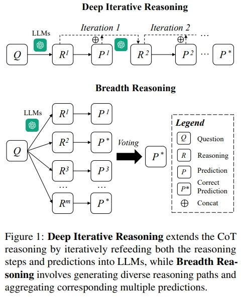
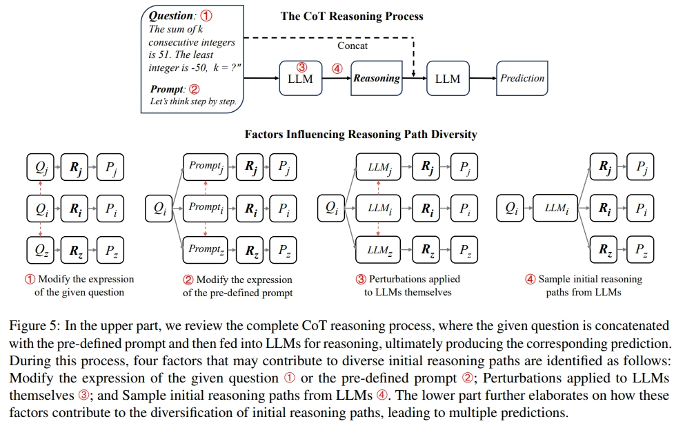

# Is Depth All You Need? An Exploration of Iterative Reasoning in LLMs
This is the official implementation of `Is Depth All You Need? An Exploration of Iterative Reasoning in LLMs`.


<div align="center">

</div>

<div align="center">

</div>


## Installation
Make sure you have Python>=3.8 installed on your machine.
```
pip install torch==1.8.2+cu111 torchtext==0.9.2 -f https://download.pytorch.org/whl/lts/1.8/torch_lts.html
pip install -r requirements.txt
```

## Set your OpenAI API key
```
client = OpenAI(
    api_key="YOUR OPENAI API KEY"
    )
```

## Quick Start

### Prompt-consistency + Self-consistency (PromptC-SC)
```
python main.py --method=zero_shot_cot --cot_trigger=1 --dataset=aqua --limit_dataset_size=10
```


